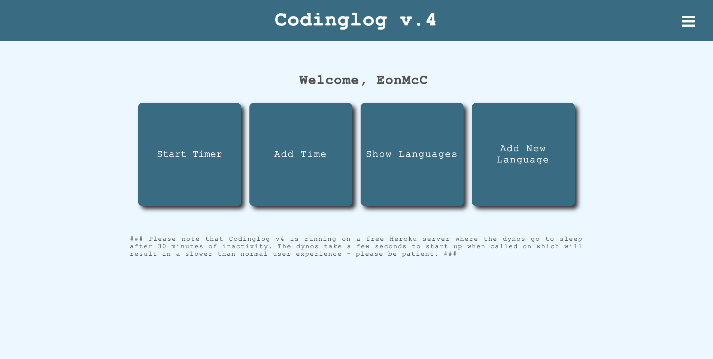
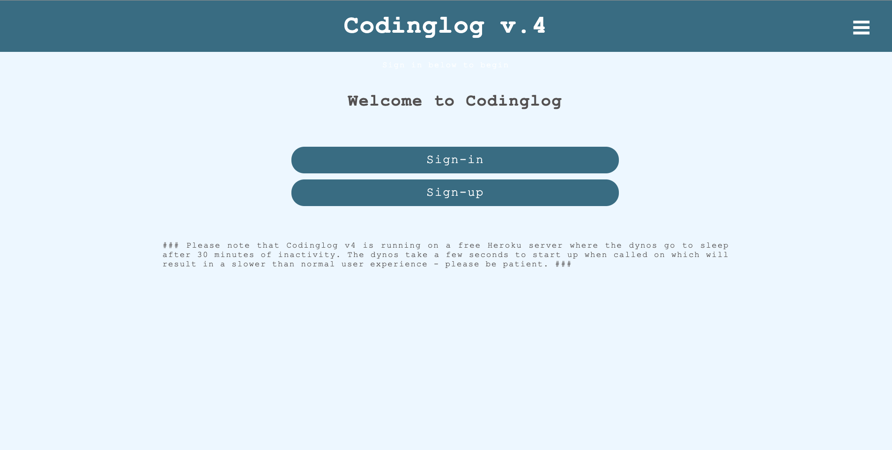

# Codinglog V4

This project is the fourth iteration of my codinglog app. It started off as a Ruby app that accepted input through the terminal. This latest version is a complete refactor which uses React and Node.js. This version also introduces a user feature, so different users can log thier individual coding times.

Feel free to try the app out at https://codinglog-v4-client.herokuapp.com/

The server code required for this app can be found at https://github.com/EonMcC/codinglog_v4_server
### `npm start`

Runs the app in the development mode. 
Open [http://localhost:3000](http://localhost:3000) to view it in the browser.
